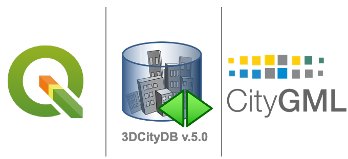

# 3DCityDB-Tools Plug-In for QGIS: Server-Side Support for 3DCityDB v.5.0

This repository provides server-side support to 3DCityDB-Tools Plug-In for QGIS, enabling GIS layer-based interaction with 3D city model data stored within 3DCityDB 5.0.
<!-- This repository contains the work of the master's thesis titled **"3DCityDB-Tools plug-in for QGIS: Adding server-side support to 3DCityDB v.5.0,"** which includes trial updates on the server side of 3DCityDB-Tools-for-QGIS tailored for 3DCityDB v.5.0. The full document is available on the [TU Delft Library](https://repository.tudelft.nl/record/uuid:5992ba24-8618-48d7-9e24-28839b5da16b). -->

  

## Quick Start
1. Install PostgreSQL & PostGIS
2. Set up 3DCityDB 5.0 and import data
3. Install QGIS package
4. Check existence of feature geometries and attributes
5. Create GIS layers
6. Interact with CityGML data via layers in QGIS

## Quick Links
- [Introduction](docs/INTRODUCTION.md)
- [Preparations](docs/PREPARATIONS.md)
- [Usage Guide](docs/USAGE.md)

## Requirements
  This server-side support of the 3DCityDB-Tools for QGIS has been developed using:
  - **[PostgreSQL](https://www.postgresql.org/) >= 12** (version 16) with **[PostGIS](https://postgis.net/) >= 3.0** (version 3.4.2)
  - **[3DCityDB 5.0 Command line tool](https://github.com/3dcitydb/citydb-tool)** (version 0.8.1-beta)
  - **[QGIS](https://www.qgis.org/download/)** (version 3.34.8-Prizren)

  For managing PostgreSQL, the open-source tool [pgAdmin4](https://www.pgadmin.org/) is in use and is recommended.

## Demo

 
<kbd>

</kbd>
  

## Acknowledgments
- TU Delft 3D Geoinformation Group ([3DCityDB-Tools for QGIS](https://github.com/tudelft3d/3DCityDB-Tools-for-QGIS))
- Virtual City Systems GmbH ([3DCityDB](https://www.3dcitydb.org/))

## Support
- You are kindly invited to submit issues, ideas, and suggestions to this repository.
- Contact: bstsai1022@gmail.com

## Citation
If you would like to get further information of the work of this repository, please have a look at the MSc thesis:

Tsai, B. S. (2024). 3DCityDB-Tools plug-in for QGIS: Adding server-side support to 3DCityDB
v.5.0 [[Link](https://repository.tudelft.nl/record/uuid:5992ba24-8618-48d7-9e24-28839b5da16b)] [[BibTeX](docs/CITATION.bib)]

<!-- ## License
This project is licensed under the Apache License 2.0 - see the [LICENSE](LICENSE) file for details. -->
