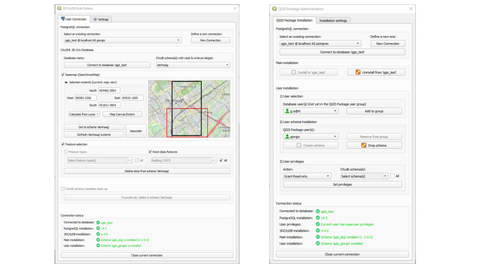

# 3DCityDB-Tools for QGIS

This repository contains code of a **QGIS plugin** that facilitates management and visualization of data stored in the CityGML **3D City Database** (aka 3DCityDB), which currently supports CityGML v. 1.0 and 2.0.

# Introduction

The plugin allows to connect to local or remote instances of the free and open-source CityGML [3D City Database](https://www.3dcitydb.org) for PostgreSQL/PostGIS and to load data as "classical" layers into QGIS. Once data layers are available in QGIS, the user can interact with them as usual, i.e. perform analyses, work with associated attributes, explore and visualise the data in 2D and 3D, etc. Additionally, data in the database can be deleted, either using classical QGIS editing tools, or bulk-wise.

As semantic 3D city models tend to be huge datasets and are generally best managed in spatial databases, the main idea behind the development of this plugin is to facilitate access and use of [CityGML](https://en.wikipedia.org/wiki/CityGML)/[CityJSON](https://www.cityjson.org/) data for those practitioners that lack a deep knowledge of the international standard [OCG CityGML data model](https://www.ogc.org/standards/citygml), and/or have limited experience with SQL/Spatial-RDBMSs in general.
The plugin consists of a server-side part (written in PL/pgSQL) and a client-side part (written in Python). 

The client-side part offers, at the moment, three GUI-based tools:
- The **Layer Loader**, to load and interact with data in the 3D City Database directly from QGIS
- The **Bulk Deleter**, to delete features from the database, either at all at once, or by means of spatial and feature-related filters.
- The **QGIS Package Administrator**, to install the server-side part of the plugin, as well as to set up database user access and user privileges.

In particular, the **Layer Loader** offers following functionalities:
- All CityGML modules are supported (Building, Bridge, Tunnel, Vegetation, Terrain, etc.)
- All LoDs are supported, whenever applicable (LoD0 to LoD4)
- Support for other geometry types other than (Multi)Polygons (e.g. multilines for Terrain Intersection Curves)
- Support for multiple citydb schemas in the same 3D City Database instance
- Multiple user support, with different privileges (i.e. read-only, read-write)
- User-friendly form-based editing of feature attributes (including generic attributes, external references, etc.); changes are stored directly into the database
- Automatically generated, hierarchical layer order in the QGIS Layers Panel
- Server-side and client-side interactive selection of the Area Of Interest (AOI) extents to load in QGIS, in order to tackle with possibly very large datasets
- Smart layer management: layers are generated only for existing data, only layers with data within the AOI extents can be selected
- Support for CityGML enumerations and codelists
- All layer geometries are 3D: they can be visualised both in 2D and in 3D (Please be aware that 3D visualisation in QGIS 3D map is still a bit unstable...).

Further details, and a user guide, can be found in the \user_guide subfolder of the plugin installation directory (see file "[3DCityDB-Tools_UserGuide.pdf](user_guide/3DCityDB-Tools_UserGuide_0.8.5.pdf)").

Some datasets for testing purposes are available, too, and are contained in the \test_datasets subfolder.

# Requirements

The plugin has been developed using [**QGIS**](https://www.qgis.org/en/site/forusers/download.html) **3.22 LTR** and **3.28 LTR**. Please note that support and further development will focus only on LTR versions.

The server-side part of the plugin requires PostgreSQL version >= 10 and PostGIS version >= 2.

Otherwise, only a working instance of the 3D City Database is required. The currently supported version of the [3DCityDB](https://github.com/3dcitydb) is the 4.x. To set up the 3D City Database and import (or export) CityGML/CityJSON data from/to it, we heartily recommend to use the free and open-source, Java-based [Importer-Exporter](https://github.com/3dcitydb/importer-exporter). Alternatively, the [3D City Database Suite](https://github.com/3dcitydb/3dcitydb-suite/releases) already ships with all necessary software tools. Further information can be found [here](https://3dcitydb-docs.readthedocs.io/en/latest/).

# Installation

The easiest way to install the plug-in is via the [QGIS Plugins repository](https://plugins.qgis.org/plugins/citydb-tools/), or directly from QGIS. Just look for the 3DCityDB-Tools plug-in!

Alternatively, you can download the plug-in zip file from here and install it manually. Please refer to the installation steps explained in the documentation, which also contains details on how to set up the server-side part of the plug-in.

# Developers

The plugin is currently developed by:
- [Giorgio Agugiaro](mailto:g.agugiaro@tudelft.nl)
- [Konstantinos Pantelios](mailto:konstantinospantelios@yahoo.com)

with contributions by:
- [Tendai Mbwanda](mailto:tmbwanda52@gmail.com)

and with additional suggestions and feedback by Camilo León-Sánchez (TU Delft), Claus Nagel and Zhihang Yao (VirtualCitySystems GmbH).

# Publications

If you use the plug-in (or part of its code) in scientific works, please consider citing us:

- Agugiaro, G., Pantelios, K., León-Sánchez, C., Yao, Z., Nagel, C., 2023,\
**Introducing the 3DCityDB-Tools plug-in for QGIS**.\
Recent Advances in 3D Geoinformation Science - Proceedings of the 18th 3D GeoInfo Conference, Springer\
(available from December 2023)

- Mbwanda, T., 2023,\
**Further Development of a QGIS plugin for the CityGML 3D City Database**.\
[Link](https://repository.tudelft.nl/islandora/object/uuid%3A6786ac5c-b61d-4e17-8501-e3cf2c7a9577) to MSc thesis

- Pantelios, K., 2022,\
**Development of a QGIS plugin for the CityGML 3D City Database**.\
[Link](https://repository.tudelft.nl/islandora/object/uuid%3Afb532bef-81b9-482b-921a-e7ce907cb544) to MSc thesis

# Future

Besides further testing and debugging, there are a number of improvements that we are thinking of, such as:
- Support for appearances (at least for X3D Materials, if possible)
- Support for ADEs
- Testing and initial support for the 3DCityDB v. 5.0 (and therefore CityGML 3.0)
- ...the sky is the limit...

# Disclaimer

This work started as a [TU Delft](www.tudelft.nl) MSc Thesis in [Geomatics](https://www.tudelft.nl/en/education/programmes/masters/geomatics/msc-geomatics) by K. Pantelios. The [3D Geoinformation group](https://3d.bk.tudelft.nl/) at TU Delft has created this fork of the initial GitHub repository to continue development in the future. You are kindly invited to submit issues (and ideas, and suggestions!) to THIS repository.
