# Usage Guide
[← Back to README](../README.md)

## Table of Contents
- [Setup](#setup)
  - [Package Installation](#package-installation)
  - [User Schema Creation](#user-schema-creation)
- [Configuration](#configuration)
  - [Extent Specification](#extent-specification)
  - [Metadata Management](#metadata-management)
- [Layer Operations](#layer-operations)
  - [Creation Methods](#creation-methods)
  - [Deletion Methods](#deletion-methods)
  - [Layer Naming Convention](#layer-naming-convention)
- [Examples](#examples)
  - [Space Feature with Specific Attributes Example](#space-feature-with-specific-attributes-example)
  - [Boundary Feature with All Attributes Example](#boundary-feature-with-all-attributes-example)
  - [Batch Layer Creation Example](#batch-layer-creation-example)
- [Limitations & Future Work](#limitations--future-work)
  - [GIS Layer Editing Support is Under Development](#gis-layer-editing-support-is-under-development)
  - [Limited Support for Features without Direct Spatial Properties](#limited-support-for-features-without-direct-spatial-properties)
- [Nota Bene](#nota-bene)

## Setup

### Package Installation
<details>
<summary>Installation Steps</summary><br>

1. Download and unzip the package of this repository
2. Open pgAdmin4
3. Create new query tool tab
4. Execute all SQL script files in order under the `postgresql` folder
5. Verify successful installation of `qgis_pkg` schema
</details>

### User Schema Creation
<details>
<summary>Create user schema for storing metadata tables and GIS layers</summary><br> 

```sql
SELECT * FROM qgis_pkg.create_qgis_usr_schema('usr_name');
```

The created schema (`qgis_usr_name`) contains 4 tables:
1. **extents**: Stores bounding box geometries for extent selection
2. **feature_geometry_metadata**: Stores metadata of existing feature geometries
3. **feature_attribute_metadata**: Stores metadata of existing feature attributes
4. **layer_metadata**: Stores user choices for generated GIS layers
</details>

## Configuration

### Extent Specification
<details>
<summary>Two types of extent specification</summary><br>

1. **Full Database Extent** (`db_schema` type, default):
    ```sql
    SELECT * FROM qgis_pkg.upsert_extents('usr_schema', 'cdb_schema');
    ```

2. **Custom Extent** (`m_view` type):
    ```sql
    SELECT * FROM qgis_pkg.upsert_extents(
        'usr_schema', 
        'cdb_schema', 
        'm_view', 
        ST_MakeEnvelope(232320, 480620, 232615, 481025, 28992)
    );
    ```

The extent type determines the bounding boxes used for:
- Checking existing feature geometries
- Checking existing attributes
- Creating GIS layers
</details>

### Metadata Management

<details>
<summary>Check Existing Geometries</summary><br>

1. **Full Schema Scan** (default):
    ```sql
    SELECT * FROM qgis_pkg.update_feature_geometry_metadata('usr_schema', 'cdb_schema');
    ```

2. **Extent-Based Scan**:
    ```sql
    SELECT * FROM qgis_pkg.update_feature_geometry_metadata('usr_schema', 'cdb_schema', 'm_view');
    ```

Results stored in `feature_geometry_metadata` table under the `usr_schema`:
<p align="center"> 
 
</p>
</details>

<details>
<summary>Check Existing Attributes</summary><br>

Similar scanning options:

1. **Full Schema Scan** (default):
    ```sql
    SELECT * FROM qgis_pkg.update_feature_attribute_metadata('usr_schema', 'cdb_schema');
    ```

2. **Extent-Based Scan**:
    ```sql
    SELECT * FROM qgis_pkg.update_feature_attribute_metadata('usr_schema', 'cdb_schema', 'm_view');
    ```

Results stored in `feature_attribute_metadata` table under the `usr_schema`:
<p align="center"> 
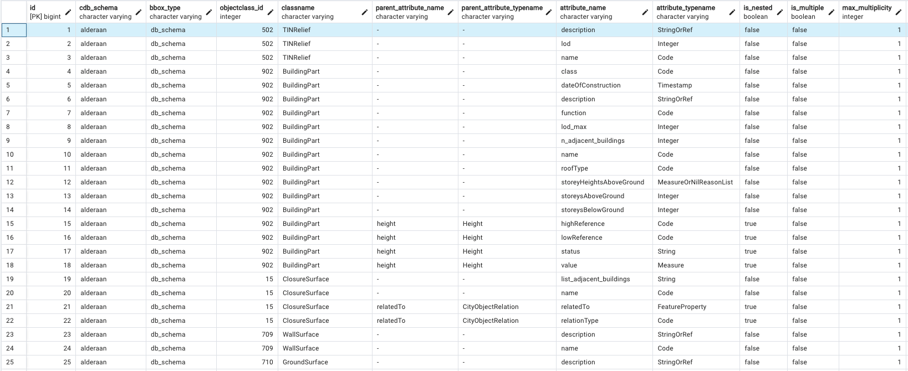 
</p>
</details>  

## Layer Operations

### Layer Creation Approach
<details>
<summary>Attribute Table Approach</summary><br>

The metadata tables provide options for:

**Geometries:**
- Desired geometry representation
- Desired LoD

**Attributes:**
- Specific attribute selection
- Generic attributes treated as "standard" attributes
- Multi-language support (e.g., kanji in column names)

**Recommended Approach** ([research reference](https://repository.tudelft.nl/record/uuid:5992ba24-8618-48d7-9e24-28839b5da16b)):
- Integrates flattening query of selected attributes into attribute table
- Stores as materialized view
- `LEFT JOIN` with geometry materialized view
<p align="center"> 
     
</p>
</details>

### Creation Methods
<details>
<summary>Create Single Layer</summary>

#### Individual Layer Creation
`qgis_pkg.create_layer()`

Required Parameters:
1. **usr_schema**: User schema name
2. **cdb_schema**: Target 3DCityDB schema name
3. **parent_objectclass_id**: Only for boundary features, 0 for space feature
4. **objectclass_id**: Target feature class ID
5. **geometry_name**: Spatial property name (e.g. `lod1Solid`, `tin`)
6. **lod**: Level of Detail number

Optional Parameters:

7. **attris**: Selected attribute names in text array (Default: null)
8. **is_matview**: Store the query as view or materialized view (Default: null)
9. **is_all_attri**: Select all existing attributes (Default: null)
10. **is_joins**: Join method selection (Default: null)
</details>


<details>
<summary>Create Multiple Layers</summary>

#### Batch Layer Creation
1. **For Single Class:**
`qgis_pkg.create_class_layers()`
```sql
-- Building class (objectclass_id = 901)
SELECT * FROM qgis_pkg.create_class_layers('usr_schema', 'cdb_schema', NULL, 901);
```

2. **For All Classes:**
`qgis_pkg.create_all_layers()`

```sql
-- All existing classes in the cdb_schema
SELECT * FROM qgis_pkg.create_all_layer('usr_schema', 'cdb_schema');
```
</details>

### Deletion Methods

<details>
<summary>Delete Single Layer</summary>

#### Individual Layer Deletion
`qgis_pkg.drop_single_layer_attri_table()`

Required Parameters:
1. **usr_schema**: User schema name
2. **cdb_schema**: CityDB schema name
3. **parent_objectclass_id**: NULL for space feature
4. **objectclass_id**: Feature class ID
5. **geometry_name**: Geometry column name
6. **lod**: Level of Detail

Optional Parameters:

7. **attris**: Attribute names array (Default: null)
8. **is_matview**: View type (Default: null)
9. **is_all_attri**: All attributes flag (Default: null)
10. **is_drop_attris**: Cascade drop flag (Default: null)

</details>

<details>
<summary>Delete Multiple Layers</summary>

#### Batch Deletion
1. **Delete Layers of a Single Class:**
`qgis_pkg.drop_class_layers_attri_table()`
    ```sql
    -- Building class (objectclass_id = 901)
    SELECT * FROM qgis_pkg.drop_class_layers_attri_table('usr_schema', 'cdb_schema', NULL, 901);
    ```

2. **Delete All Layers:**
`qgis_pkg.drop_all_layer()`

    ```sql
    -- All existing classes in the cdb_schema
    SELECT * FROM qgis_pkg.drop_all_layer('usr_schema', 'cdb_schema');
    ```
</details>

<details>
<summary>Understanding Layer Names</summary>

### Layer Naming Convention

1. **GIS Layer Names:**
  - Prefix: `=lmv` (layer materialized view)
  - Components: `cdb_schema_class-alias_lod_geometry-type`
  - Suffix: `attri_table` or `no_attri_table`

2. **Attribute Table Names:**
- Prefix: `_amv` (attribute materialized view)
- Components: `cdb_schema_class-name_g_[ID]`
- Suffix: `attributes`

Layer information stored in `layer_metadata` table under the `usr_schema`:
<p align="center"> 
   
</p>
</details>

## Examples

### Space Feature with Specific Attributes Example
<details>
<summary>Creating a layer of Building class (objectclass_id = 901) with specified attributes</summary><br>

```sql
SELECT * FROM qgis_pkg.create_layer(
    'usr_schema', 
    'cdb_schema', 
    0,                             -- Space feature
    901,                           -- Building class ID
    'lod1Solid',                   -- Geometry type
    1,                             -- LoD number
    ARRAY['function', 'height'],   -- Selected attributes
    TRUE                           -- As materialized view
);
```
Result:
<p align="center"> 
 
</p>

Generated views:
- `=lmv_alderaan_bgd_lod1_Solid_attri_table`
- `_amv_alderaan_Building_g_[ID]_attributes`
</details>

### Boundary Feature with All Attributes Example
<details>
<summary>Creating a layer of Building-RoofSurface class (objectclass_id: 901-712) with all existing attributes</summary><br>

  ```sql
  SELECT * FROM qgis_pkg.create_layer(
      'usr_schema', 
      'cdb_schema', 
      901,                           -- Parent: Building
      712,                           -- RoofSurface class ID
      'lod2MultiSurface',            -- Geometry type
      2,                             -- LoD number
      NULL,                          -- No specific attributes
      TRUE,                          -- As materialized view
      TRUE                           -- All attributes
  );
```
Result:
<p align="center"> 
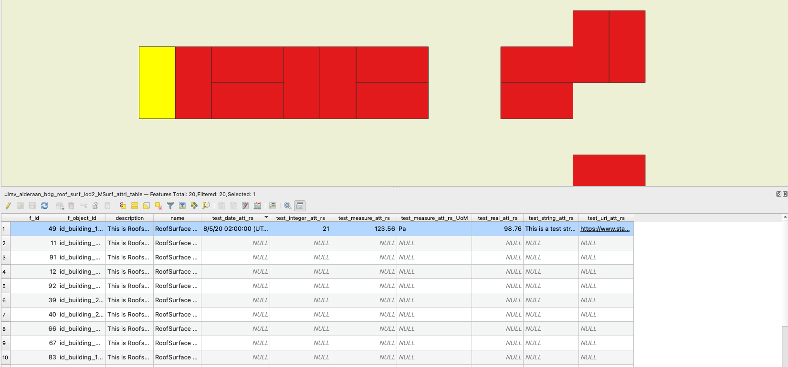 
</p>

Generated views:
- `=lmv_alderaan_bgd_roof_surf_lod2_MSurf_attri_table`
- `_amv_alderaan_RoofSurface_g_[ID]_attributes`
</details>

### Batch Layer Creation Example
<details>
<summary>Create Layers for All Classes</summary><br>

Creating layers for all existing classes in the `cdb_schema`:
```sql
SELECT * FROM qgis_pkg.create_all_layer('usr_schema', 'cdb_schema');
```

- Railway dataset result:
    <p align="center"> 
    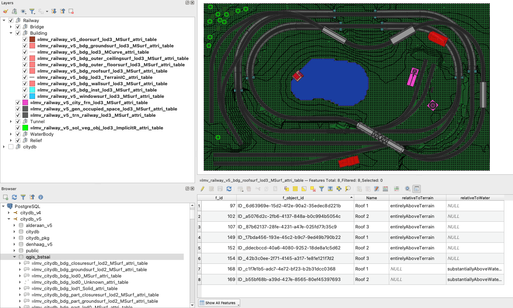 
    </p>
    <p align="center"> 
     
    </p>

- Rijsen-Holten dataset result:
    - Full extent:
        <p align="center"> 
         
        </p>
        <p align="center"> 
        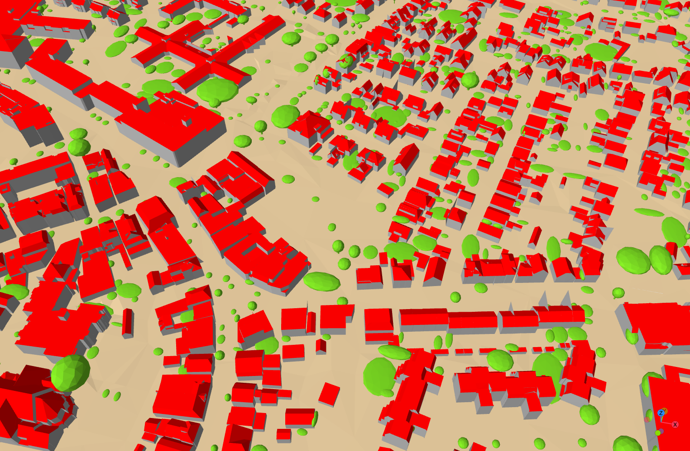 
        </p>

    - Smaller extent:
        <p align="center"> 
        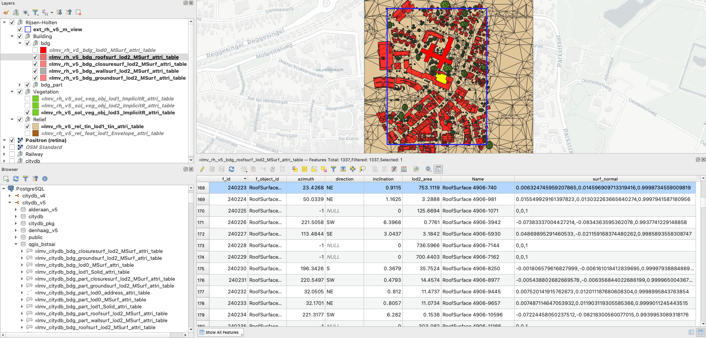 
        </p>
        <p align="center"> 
        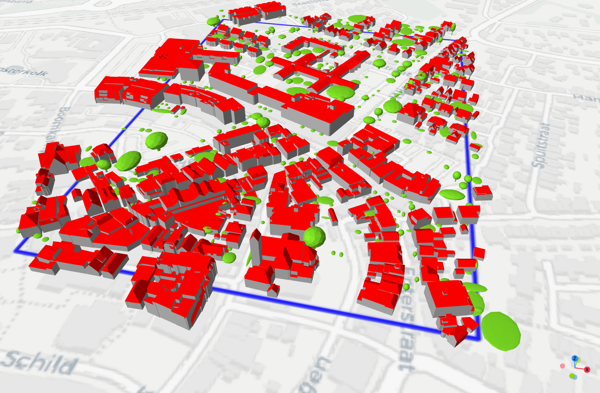 
        </p>

- Tokyo dataset result:
    <p align="center"> 
     
    </p>
    <p align="center"> 
    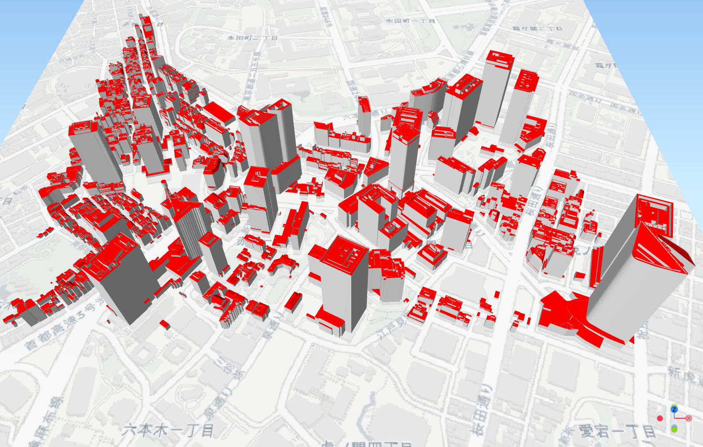 
    </p>

- New York Transportation dataset result:
    <p align="center"> 
    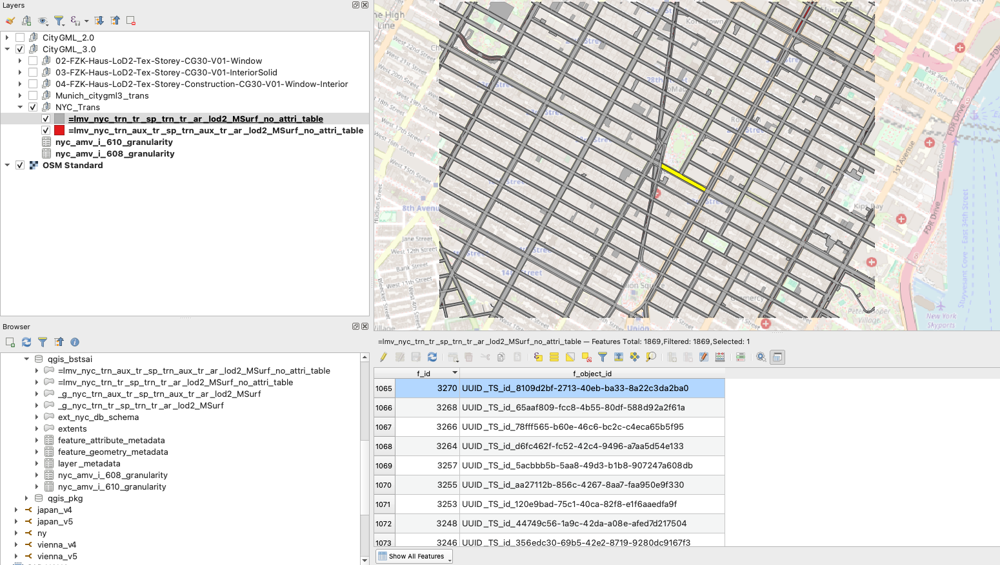 
    </p>
    <p align="center"> 
    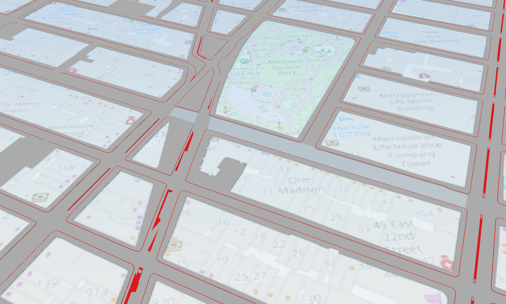 
    </p>
</details>

## Limitations & Future Work

### GIS Layer Editing Support is Under Development
<details>
<summary>Potential Approaches</summary><br>

The current implementation stores GIS layers as materialized views, which do not inherently support updates. This means that edits made to feature attributes in QGIS cannot be directly propagated back to the underlying 3DCityDB 5.0 database.

Future development will focus on enabling bidirectional editing capabilities, allowing users to modify feature attributes through the GIS layers while maintaining data consistency with 3DCityDB 5.0. Some potential approaches being considered include:

- [Implementing Incremental View Maintenance (IVM)](https://www.postgresql.org/about/news/pg_ivm-19-released-2902/) techniques to make materialized views updatable
- Creating trigger-based mechanisms to propagate changes between views and base tables
- Developing an intermediate layer to handle view updates and database synchronization

This enhancement will provide a more complete workflow for interacting with 3D city model data through QGIS, while preserving data integrity in the underlying 3DCityDB structure.
</details>


### Limited Support for Features without Direct Spatial Properties
<details>
<summary>Two alternative approaches</summary><br>

Currently, features without direct geometry representations (e.g., traffic spaces in transportation data) have limited visualisation via GIS layers. Two potential approaches are being considered for future development:

1. **Feature Bounding Box Envelopes**
   - Using feature envelopes from the FEATURE table as alternative geometries
   - Quick to implement but provides only coarse spatial representation
   - May have overlapping geometries making spatial analysis difficult

2. **Child Feature Geometry Aggregation** 
   - Aggregating geometries from child features to represent parent features
   - More accurate spatial representation than envelopes
   - Enables visualisation of semantic hierarchies (e.g., traffic areas → roads/squares → sections/intersections)
   - Requires more complex SQL queries and data processing

<table>
<tr>
<td width="50%">
<p align="center">
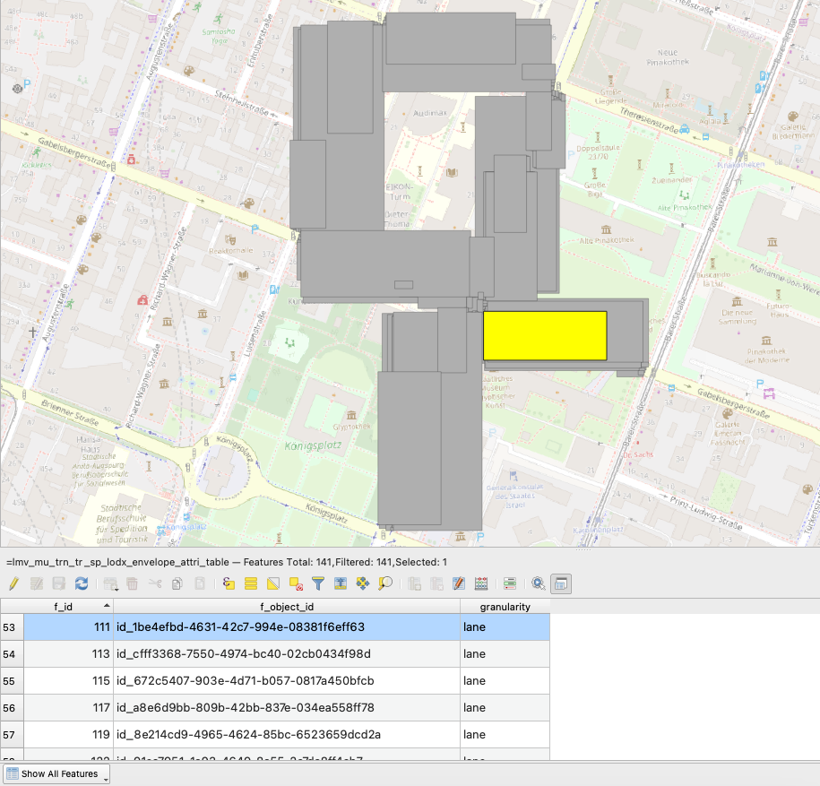
<br>
<em>Feature Envelope</em>
</p>
</td>
<td width="50%">
<p align="center">
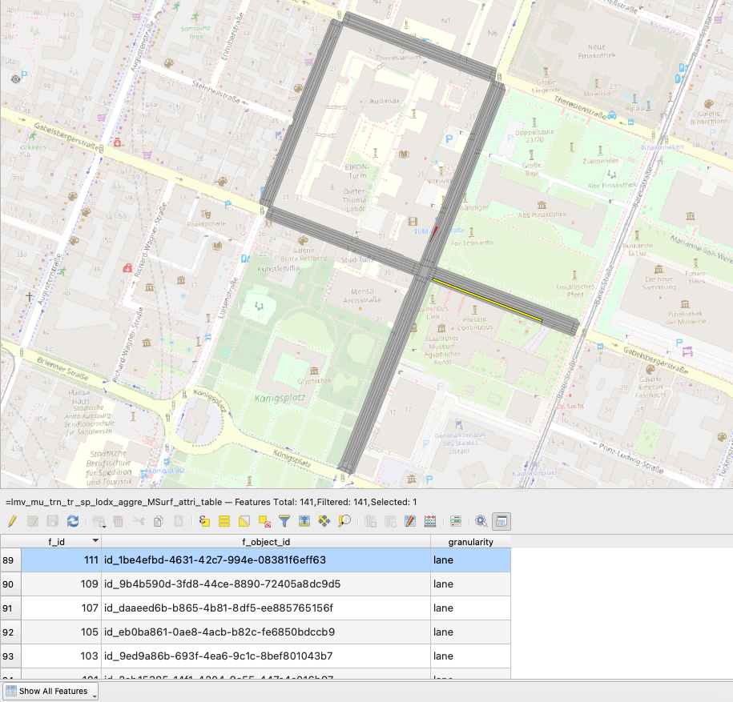
<br>
<em>Child Feature Geometry Aggregation</em>
</p>
</td>
</tr>
</table>

Future work will focus on implementing both approaches to provide comprehensive support for CityGML 3.0 features without direct geometries, allowing users to:
- Access and visualise all feature attributes regardless of geometry representation
- Explore semantic hierarchies through additional derived layers
- Perform spatial analysis on aggregated geometries
- Choose between quick envelope views or detailed aggregated views based on needs

<table>
<tr>
<td width="33%">
<p align="center">
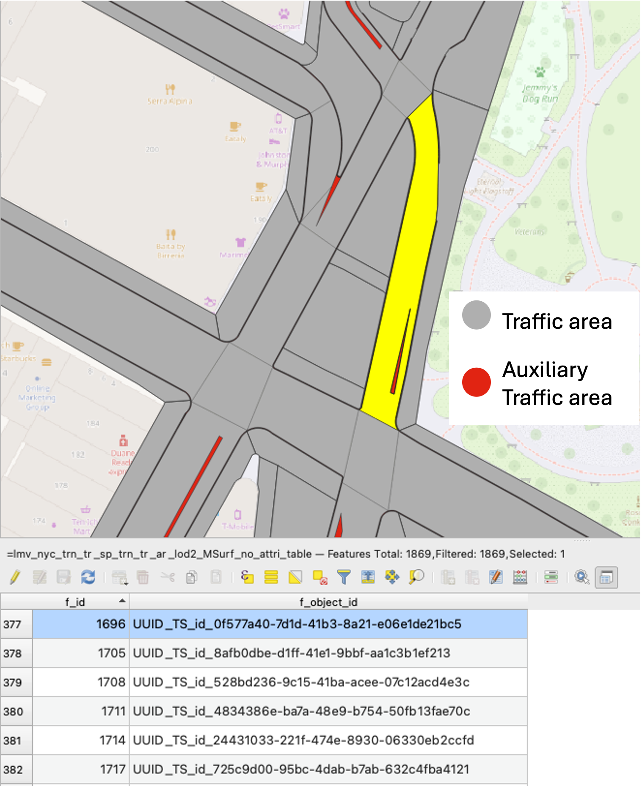
<br>
<em>Original layer of (Auxiliary) traffic area</em>
</p>
</td>
<td width="33%">
<p align="center">
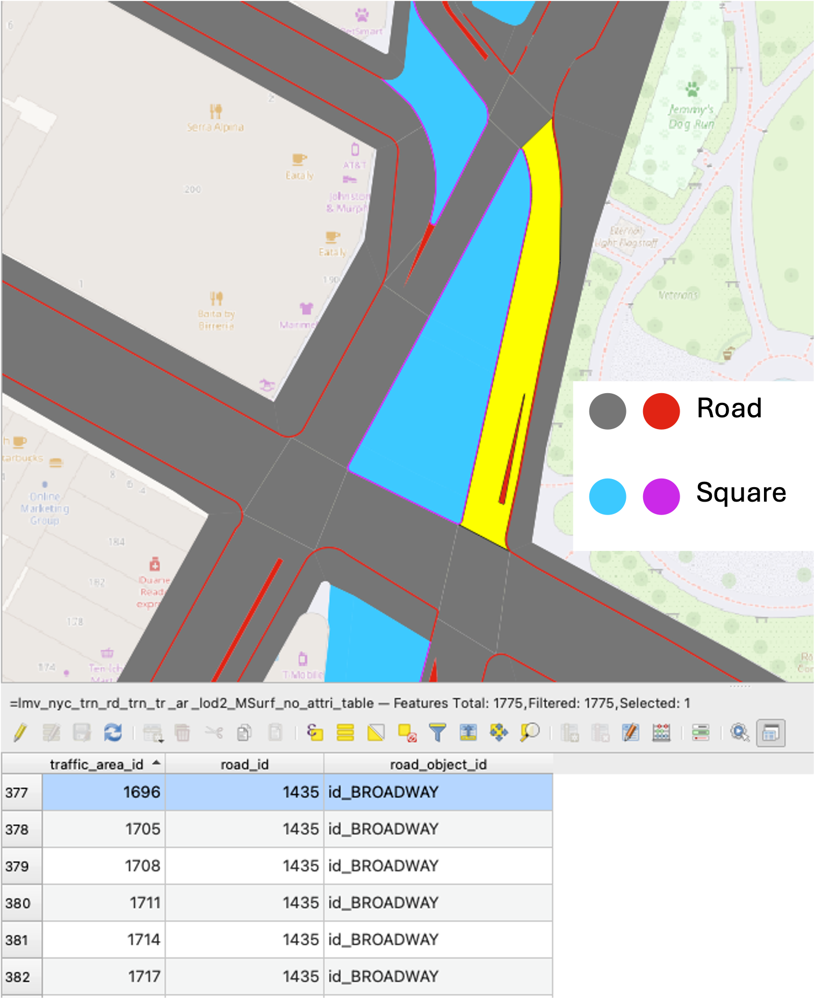
<br>
<em>Derived layer of Road and Square</em>
</p>
</td>
<td width="33%">
<p align="center">
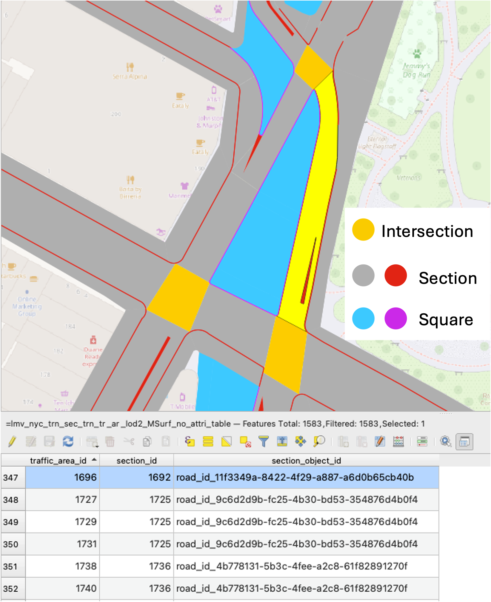
<br>
<em>Derived layer of (Inter)Section and Square</em>
</p>
</td>
</tr>
</table>
</details>

### Nota Bene
- Keep the names of  `cdb_schema` short, otherwise PostgreSQL will auto-truncate the layer names and, which will cause the failure of `create_layer()` function.
- Create / Drop layers materialized views in pgAdmin4 are not reflected in metadata tables.